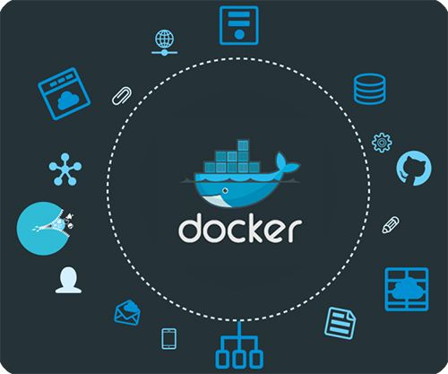

# Docker

## 介绍



## 安装

### Linux

```bash
sudo apt-get update
sudo apt-get install -y docker.io
```

### Windows

## 概念

### 镜像

### 容器

### 仓库

## 启动

```bash
docker version
sudo service start docker
```

## 命令

```bash
docker version
docker info
docker ps
# docker run [OPTIONS] IMAGE[:TAG] [COMMAND] [ARG...]
docker run -dP nginx
docker run -d -p 8080:80 --name mynginx nginx
# docker images [OPTIONS] [REPOSITORY[:TAG]]
docker images
# docker pull [OPTIONS] NAME[:TAG]
docker pull nginx
docker build -t jpress:latest .
# docker exec 
docker exec -it nginx bash
docker stop f9
```

## Dockerfile

由命令语句组成，支持以 `#` 开头的注释行，Dockerfile分为四部分

1. 基础镜像信息
1. 维护者信息
1. 镜像操作指令
1. 容器启动时执行指令

### 指令

1. FROM：必须是第一个，可使用多个
1. MAINTAINER：维护者信息
1. RUN：在镜像中执行的命令(shell/exec)，命令较长时可以使用 `\` 换行
    RUN command 或 RUN ["executable", "param1", "param2"]
    前者等同于RUN ["/bin/bash", "-c", "echo hello"]
1. COPY：复制本地主机的 `<src>` 到容器中的 `<dest>` 。当使用本地目录为源目录时，推荐使用 `COPY` 。
    ```dockerfile
    # COPY <src> <dest>
    ```
1. ADD：将复制指定的 `<src>` 到容器中的 `<dest>`，`<src>` 可以是Dockerfile所在目录的一个相对路径，也可以是一个URL，或者一个tar文件（自动解压为目录）。
    ```dockerfile
    # ADD <src> <dest>
    ```
1. CMD：只执行一条CMD，指定多条后边的会覆盖前边的，如果运行容器时指定了运行的命令会覆盖CMD命令，有三种格式
    CMD ["executable","param1","param2"] 使用 exec 执行，推荐方式；
    CMD command param1 param2 在 /bin/sh 中执行，提供给需要交互的应用；
    CMD command param1 param2 在 /bin/sh 中执行，提供给需要交互的应用；
1. ENTRYPOINT：配置容器启动后执行的命令，并且不可被 `docker run` 提供的参数覆盖。每个 DockerFile 中只能由一个 `ENTRYPOINT` ，指定多个只有最后一个生效。
    ```dockerfile
    # ENTRYPOINT ["executable", "param1", "param2"]
    # ENTRYPOINT command param1 param2 (shell中执行)
    ```
1. ENV：指定一个环境变量，会被后续 `RUN` 指令使用，并在容器运行时保持。
    ```dockerfile
    # ENV <key> <value>
    ```
1. ARG：
1. VOLUME：创建一个可以从本地主机或其他容器挂载的挂载点，一般用来存放数据库和需要保持的数据等。
    ```dockerfile
    VOLUME ["/data"]
    ```
1. EXPOSE：暴露端口，在启动容器时需要通过 -P，Docker 主机会自动分配一个端口转发到指定的端口。
    ```dockerfile
    # EXPOSE <port> [<port>...]
    ```
1. WORKDIR：为后续的 `RUN`、 `CMD`、 `ENTRYPOINT` 指令配置工作目录。
    ```dockerfile
    WORKDIR /path/to/workdir
    ```
1. USER：指定运行容器时的用户名或 UID ，后续的 `RUN` 也会使用指定用户。
    ```dockerfile
    USER daemon
    ```
1. HEALTHCHECK：
1. ONBUILD：配置当所创建的镜像作为其他新创建镜像的基础镜像时，所执行的操作指令。
    ```dockerfile
    # ONBUILD [INSTRUCTION]
    ```

## Docker Compose

## 参考文档

1. [Docker中文文档](http://www.dockerinfo.net/document)
1. [[手把手系列之]Docker 部署 vue 项目](https://juejin.im/post/5cce4b1cf265da0373719819)
1. [Docker小栈-【docker ps】](https://www.jianshu.com/p/8474119c8cd1)
1. [docker如何退出就删除容器（示例）](https://blog.csdn.net/qq_36850813/article/details/96848886)
