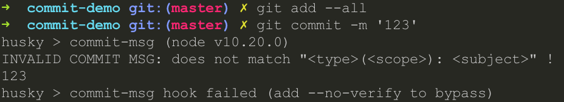
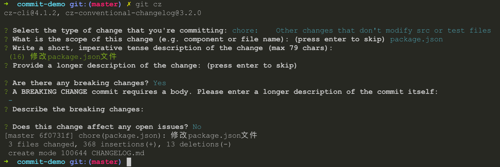

# Git commit 规范及自动生成 CHANGELOG

1. validate-commit-msg
1. husky
1. commitizen
1. cz-conventional-changelog
1. conventional-changelog-cli

## commit 信息规范

格式

type 类型

1. feat: 新功能
1. fix: 修补 bug
1. docs: 文档
1. style: 格式（不影响代码运行）
1. refactor: 重构（既不是新增功能，也不是修改bug的代码变动）
1. test: 增加测试
1. chore: 构建过程或辅助工具的变动

## 使用validate-commit-msg 检查 Commit message 是否符合格式

1. 安装 npm 包

```bash
npm install —save-dev husky validate-commit-msg
```

2. 在 package.json 中增加如下代码

```json
"husky": {
    "hooks": {
        "commit-msg": "validate-commit-msg"
  }
}
```

完成之后 Commit message 不符合格式时提示错误, 如下图所示



## 使用 commitizen 自动生成 Commit message

```bash
npm install -g commitizen
yarn global add commitizen
commitizen init cz-conventional-changelog —save —save-exact
```

执行成功之后, 会自动在 package.json 文件中增加以下配置

```json
"config": {
  "commitizen": {
    "path": "./node_modules/cz-conventional-changelog"
  }
}
```

提交时使用 git cz 命令代替 git commit, 执行以下步骤生成符合格式的 Commit message



1. 选择type
1. 更改的范围（组件或者文件名）
1. 简要描述
1. 详细描述
1. 是否重大变化
1. body, 有关提交本身的详细说明
1. 描述重大变化
1. 会不会影响任何为解决的问题吗

## 使用 conventional-changelog 自动生成 CHANGELOG

```bash
npm install -g conventional-changelog
yarn global add conventional-changelog
```

conventional-changelog

- -i, —infile  从此文件中读取 CHANGELOG
- -o, —outfile  将 CHANGELOG 写入此文件
- -s, —same-file  输出到 infile
- -p, —preset  预设, angular | atom | codemirror | ember | eslint | express | jquery | jscs | jshint
- -k, —pkg  package.json 所在位置的文件路径, 默认是距离 cwd 最近的 pakcage.json
- -a, —append  是否应将较新的版本附加到旧版本, 默认为 false  其实就是正序还是倒序
- -r, —release-count  从最新生成的版本数 默认为1, 如果指定为0则重新生成整个 CHANGELOG, 并且覆盖输出文件
- -u, —output-unreleased  输出未发布的 changelog
- -v, —verbose  详细输出. 使用它进行调试, 默认为 false
- -n, —config  配置脚本的文件路径
- -c, —context  用于定义模板变量的 json 的文件路径
- -l, —lerna-package  
- -t, —tag-prefix  读取标签时要考虑的标签前缀
- —commit-path  生成范围为特定目录的变更日志

## 参考链接

1. [AngularJS Git Commit Message Conventions](https://docs.google.com/document/d/1QrDFcIiPjSLDn3EL15IJygNPiHORgU1_OOAqWjiDU5Y/edit#heading=h.greljkmo14y0)
1. [Commit message 和 Change log 编写指南](http://www.ruanyifeng.com/blog/2016/01/commit_message_change_log.html)
1. [git commit、CHANGELOG 和版本发布的标准自动化](https://www.cnblogs.com/zivxiaowei/p/10089201.html)
1. [git commit 规范](https://www.jianshu.com/p/856bbb5ed9ec)
